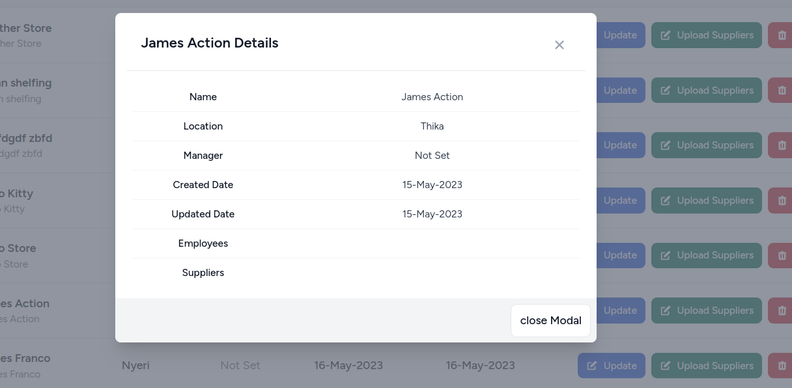

## Supermarket test

### Technical Choices

- I used Inertia JS/Vue3/pinia store since it allows me to build a fully JavaScript-based single-page application without any of
  the added complexity.
- Used Redis cache to cache welcome page posts queries which enables low latency and high throughput data access.
- HTTP get and a scheduled command to import posts from the external API.
- Out of the box authentication and authorization for laravel 9.
- Unit Tests for all end points.
- Auth middleware and a simple helper function to secure roots and controller methods.

### Not complete
- Import Employees.
- Toggle Display.

To get started, clone the repository first and then install composer packages.

```bash
git clone git@github.com:MartinPirate/blog_app.git
```

install package for laravel

```bash
composer install
```

install package for npm

```bash
npm install
```

build assets

```bash
npm run dev
```

Create the  `.env` file by copying `.env.example` file.

```bash
cd blog_app
cp .env.example .env
```

Then, generate the application key by running the following command in the terminal.

```bash
php artisan key:generate
```

After this step, update database credentials in the `.env` file.

```env
DB_CONNECTION=mysql
DB_HOST=127.0.0.1
DB_PORT=3306
DB_DATABASE=blog_app
DB_USERNAME=root
DB_PASSWORD=
```

After this step, setup database credentials in the `.env` file.

```env
REDIS_CLIENT=predis
REDIS_HOST=127.0.0.1
REDIS_PASSWORD=null
REDIS_PORT=6379
```

For database set up and data seeding run, it will create an admin user and 3 more different users with 3 posts each for
testing

```bash
php artisan migrate --seed
```
Dashboard Page 


Supermarkets


managers 


users 


Supermarket details 




Delete Modal 


Oncreate 


